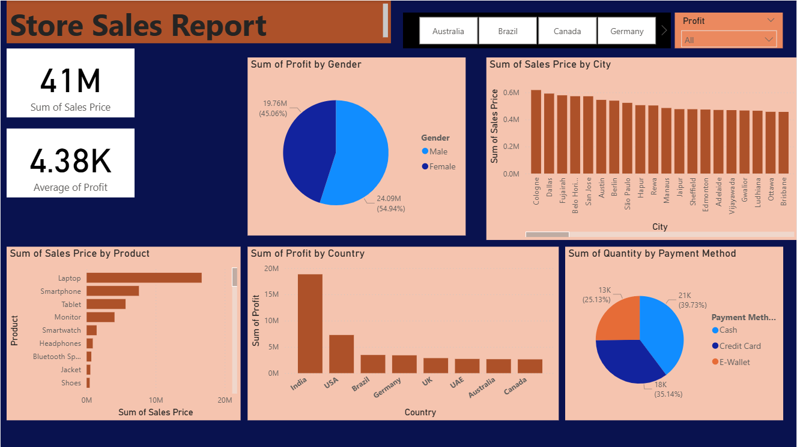

# Store-Sales-Analysis-Dashboard-Power-BI-
Developed an interactive Power BI dashboard for retail store sales, highlighting revenue trends, promotional impact, and top-performing stores.

# 🛒 Store Sales Analysis Dashboard (Power BI)

## 📌 Project Overview
This project analyzes **store sales data** using **Power BI** to uncover trends in revenue, promotions, and seasonal demand.  
The goal is to provide **business intelligence insights** for better sales strategies and decision-making.

## 📊 Dataset Description
The dataset contains **7,300 records** of store sales between **2022–2024** with the following fields:

- `date` → Date of sales  
- `Day` → Day of the week  
- `Month` → Month name  
- `Year` → Sales year  
- `store` → Store ID  
- `sales` → Sales amount  
- `promo` → Promotion status (`Active` / `Not Active`)  
- `holiday` → Day type (`Working Day` / `Holiday`)  

## 🧹 Data Cleaning & Preprocessing
- Converted `date` column into datetime format for time-series analysis  
- Checked and confirmed **no missing values**  
- Standardized categorical fields (`promo`, `holiday`)  
- Removed duplicate rows to maintain data integrity  
- Ensured numerical columns (`sales`, `Year`, `store`) are properly formatted  

## 📈 Key Insights from Dashboard
- **Sales distribution** across stores and years  
- Impact of **promotions** on sales performance  
- Seasonal trends by **month and weekday**  
- Effect of **holidays vs working days** on revenue  
- Top-performing stores and growth patterns  

## 🛠 Tools & Skills
- **Power BI** – Data visualization & dashboarding  
- **Data Cleaning** – Ensuring accurate dataset  
- **Exploratory Data Analysis (EDA)** – Identifying key patterns and trends  

## 📂 Repository Contents
- `store_sales.csv` → Cleaned dataset used for analysis  
- `Sales_Data_Desktop.pbix` → Power BI dashboard file  
- `Screenshots/` → Visual snapshots of dashboard  
- `README.md` → Project documentation  

## 📸 Dashboard Preview

---

✨ Feel free to fork or star ⭐ this repo if you found it useful!
